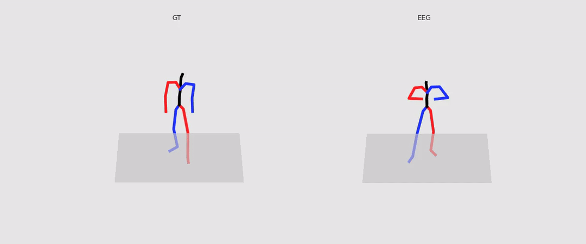
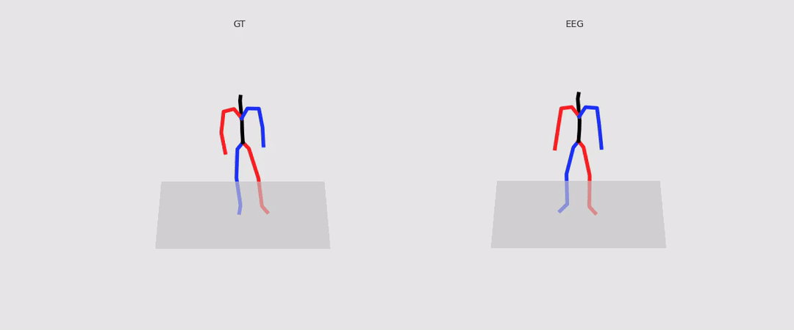
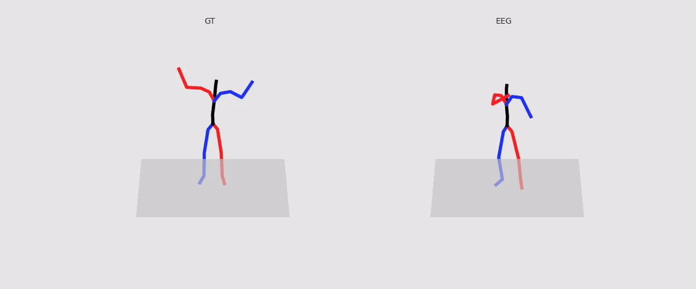

# Mind2Motion: Semantic Alignment for EEG-Driven 3D Human Motion Generation

This is the official repository for the paper **Mind2Motion: Semantic Alignment for EEG-Driven 3D Human Motion Generation**.

Mind2Motion investigates EEG-driven 3D human motion generation under an action-observation paradigm. The framework first aligns EEG responses with action-centric textual semantics and then uses the aligned semantic condition to guide diffusion-based 3D motion generation.

## Qualitative Results

Selected qualitative comparisons between ground-truth and EEG-generated motions.  
Left: Ground Truth (GT), Right: EEG-generated motion.

  

  

  

These examples illustrate representative successful cases under EEG-conditioned 3D human motion generation. The generated sequences preserve high-level action semantics and produce temporally coherent motion trajectories under favorable EEG decoding conditions.

### Video Links

| Case | MP4 |
|:---:|:---:|
| Case 1 | [View MP4](./assets/videos/case1.mp4) |
| Case 2 | [View MP4](./assets/videos/case2.mp4) |
| Case 3 | [View MP4](./assets/videos/case3.mp4) |

## Qualitative Image Examples

  

  <em>Qualitative examples of EEG-driven 3D human motion generation. Left: Ground Truth (GT), Right: EEG-generated motion.</em>

## Updates

- 🚧 **Code is coming soon!** Stay tuned for updates.
- 📄 Paper and project page will be released after publication.

## Contact

If you have any questions, feel free to open an issue.
