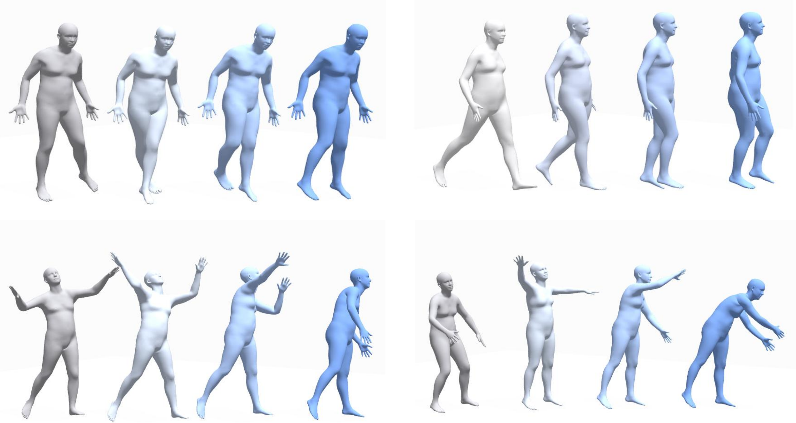

# Mind2Motion: Semantic Alignment for EEG-Driven 3D Human Motion Generation

This is the official repository for the paper **Mind2Motion: Semantic Alignment for EEG-Driven 3D Human Motion Generation**.

Mind2Motion investigates EEG-driven 3D human motion generation under an action-observation paradigm. The framework first aligns EEG responses with action-centric textual semantics and then uses the aligned semantic condition to guide diffusion-based 3D motion generation.

## Qualitative Results

  

  <em>Qualitative examples of EEG-driven 3D human motion generation. Left: Ground Truth (GT), Right: EEG-generated motion.</em>

### Representative Successful Cases

| Case | Preview |
|:---:|:---|
| Case 1 | [View MP4](assets/videos/0004_002880_r1_eeg_32ch_rank01_tid0998_sample01_gt_vs_eeg.mp4) |
| Case 2 | [View MP4](assets/videos/0034_003117_r1_eeg_32ch_rank01_tid0169_sample01_gt_vs_eeg.mp4) |
| Case 3 | [View MP4](assets/videos/0042_003140_r1_eeg_32ch_rank01_tid2243_sample01_gt_vs_eeg.mp4) |

These examples show side-by-side comparisons between the ground-truth motion and the EEG-conditioned generated motion. The generated sequences preserve high-level action semantics and produce temporally coherent 3D human motion trajectories under favorable EEG decoding conditions.

## Updates

- 🚧 **Code is coming soon!** Stay tuned for updates.
- 📄 Paper and project page will be released after publication.

## Contact

If you have any questions, feel free to open an issue.
